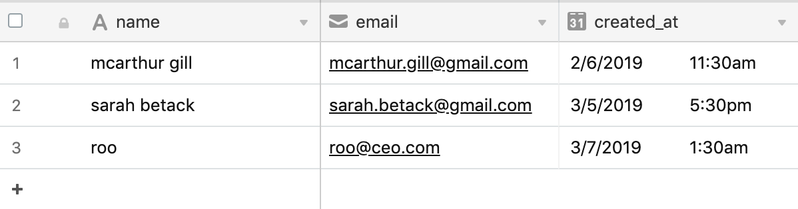
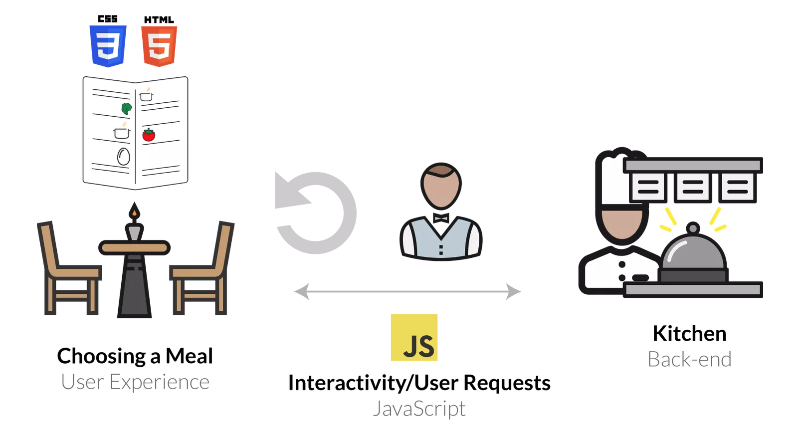

# Let's store some data!

### What is a database?
Typically when developers store data, they store their data in a database. You can think of most databases as a giant spreadsheet. Let's say we're storing data about our users in a database, we might store their name, email address, and the date/time they created their account. You would have a different row in the database for every user, and each column would store a different attribute about that user (such as their name/email). A visualization of our database with some sample data might look like this: 



### What's the difference between frontend and backend? 
So far in this course, we have focused completely on "frontend" web development. Most web applications have frontend code (which is what you've been building) and then backend code, which focuses on storing and managing the data you've collected from your users. Backend code can be written in many different languages, some of the most prominent ones are: Python, Ruby, PHP, JavaScript (yes you can write backend code in JS), Java (unrelated to JavaScript), and many others. 

The typical flow goes something like this: 



* A user goes to a webpage (think Twitter) and sees the frontend code (what we've been building: HTML, CSS, JS)
* The user enters some of their info into a form to login, and via JavaScript their information is sent to the backend 
* The backend then checks the database to make sure that user's information was entered correctly
* If it was, the backend responds to the frontend with more data about that user (like the tweets that should be shown to that user, trending topics, etc)
* The frontend code displays this information from the backend in a nice-looking way
* The user scrolls through their tweets and if they decide to "retweet" something, that "onclick" event for the retweet button is captured by JavaScript, and then sent to the backend to be stored in the database. 
* The backend responds to the frontend with a "Success" message and stores that "retweet" in the database. 
* Rinse and repeat. 


### Time to store some data
**In this course, we are not going to teach you a backend programming language (or framework), but people have built some great workarounds so that frontend-only applications can store data as well. The best of these solutions (IMO) is Airtable.**

Airtable is a beautiful mixture between a spreadsheet and a database. They have a wonderfully simplistic API that allows you to retrieve and store your data via AJAX. Let's get started. 

1. Go to [Airtable](https://airtable.com/) and make an account. For your use-cases, you should not need to pay for Airtable, so **DO NOT** put your credit card in and just use the free membership option. 

1. Airtable will take you through a series of steps at the signup and at the end of those steps, you'll see a set of demo "Workspaces". Click through some of these, edit some data, and get a feel for some of what you can do in Airtable. 

1. Once you're done with that, we are going to "Add a Base" that will store user scores for a game like 2048, so click that button, and then select "Start from Scratch". Name your base whatever you'd like (I named mine 2048_db). I typically like to keep my databases lowercased and use underscores to separate words (since this makes the API requests cleaner). To each, their own. Also, rename the table from "Table 1" to something like "game_log" since we'll be storing a log scores from a game.

1. Click on your "Base" and let's change some of the fields (attributes) also known as "columns" to reflect what we are trying to store. For our 2048 game, we should store a `username`, `score`, and `created_at` (date/time) the score was created. Change the column names to reflect what we need to store (`username`, `score`, `created_at`). I also like to use the same naming conventions for my column names as for my database names (lowercase + underscores for spaces). Again, this makes your API requests easier and capitalizations matter! 

1. Now, we'll likely want to store our score as a number, so click on the dropdown arrow for our "score" column, and let's customize the field type to be a number. Set this value as an integer instead of a decimal number, then click save. 

1. Do the same thing to our `created_at` field, only change the field type to Date, and click the switch to "Include a time field". 

1. Add 3 rows of fake data into our game_log table, so we have some sample data to play with. 

1. Now since we are going to interact with our database via the API, we need an API Key so that Airtable knows it's us requesting the data. Click the profile image in the top right corner, and then select "Account". Scroll down and click "Generate API Key". Copy the API Key to your clipboard and then create a variable called `api_key` in your script.js and store your api key as a string. 

1. Okay, now our database is set up and we're ready to write some code. Go back to the tab with our database and click "Help" in the top right corner, then click "API Documentation". The Airtable API Documentation actually uses your database and table information in its examples (very cool...I know). 

1. Scroll down until you see "List game_log records". You'll see the example URL on the right side after the word `curl`. Let's copy/paste the URL into a variable named `airtable_endpoint`. It should look something like this: `"https://api.airtable.com/v0/appk6ct5l7ib1aLC2/game_log?maxRecords=3&view=Grid%20view"`

1. Now remove the `maxRecords` and `view` parameters from the url, and let's add in our api_key so it looks more like this: `var airtable_endpoint = "https://api.airtable.com/v0/appk6ct5l7ib1aLC2/game_log?api_key=" + api_key;`. 

1. Write a GET request (like we did for the Dog API in [NashWD-6B](https://github.com/codebug-us/NashWD-6B)) to the Airtable API to fetch all the records in our database. In the `done` function, console.log the response. Once you've completed this, open the index.html file and look at the console. You will need to click through the object returned in order to see your 3 records of data.

1. Alright! Not bad! We can now read data from our database. Let's write some data to our database.

1. First, we'll need to create some [JSON](https://www.w3schools.com/js/js_json_intro.asp) (JavaScript Object Notation) which is really just a formal syntax we use to send data to and from different web applications. Our JSON will need to contain the information we want to write to our database, and format it according to the structure of our database. Here's an example: 

```
var new_record = {
	"fields": {
		"username": "i_was_just_written_username", 
		"score": 43, 
		"created_at": new Date()
	}
};
var new_record_json = JSON.stringify(new_record);
```

Notice that the `username`, `score`, and `created_at` match exactly to the columns in our database. See how each column name (also known as a `key`) is separated by it's value using a `:`, that is a typical convention used to say this `key` is associated with this `value`. So `score` is associated with `43` by the colon-separation. We separate each key-value pair with a comma, and surround them with curly braces `{}`. You'll see that the key `fields` is actually pointing to it's value `{"username": "i_was_just_written_username", "score": 43, "created_at": new Date()}` which is just all the fields. Airtable requires you to put all your values inside the key `fields` so everything stays organized. `new Date()` is simply a way to create a new Date object for the current date/time in JavaScript.

We then convert our JavaScript object into official JSON using the [JSON.stringify](https://www.w3schools.com/js/js_json_stringify.asp) command. 

Add that code to your script.js file, and let's write to our database. 

1. Notice in the API Documentation, if you scroll down to "Create game_log records" that the first line says to submit a POST request. That's exactly what we're going to do. We are now sending data to Airtable, and when we send data, we use a POST request. POST requests in AJAX are very similar to GET requests, but contain a few more pieces of information: 

```
	var writeRequest = $.ajax({
		url: airtable_endpoint,
		method: "POST",
		contentType: "application/json",
		data: new_record_json,
	});

	writeRequest.done(function(response){
		console.log("writing response: ", response);
	});
```

Notice there are two new key-value pairs in our AJAX request (`contentType` and `data`). `contentType` tells Airtable that the data we are sending them is JSON, and then our `data` field is just sending the JSON-formatted data we created. Our `done` function is exactly the same as before. 

Add these lines into your script.js file and refresh your Chrome page. Once you do, if you don't see any errors, navigate back to your Airtable database and see if you can view the new row we just added!

**Obviously in this example we hardcoded the data we are sending. In a more real-life scenario, when the user comes to play your game, you would have them enter their username, you would store that in a variable, you would store their score as they play the game in a variable, and when the game ends, you would format the data and submit it to Airtable to be saved.**


